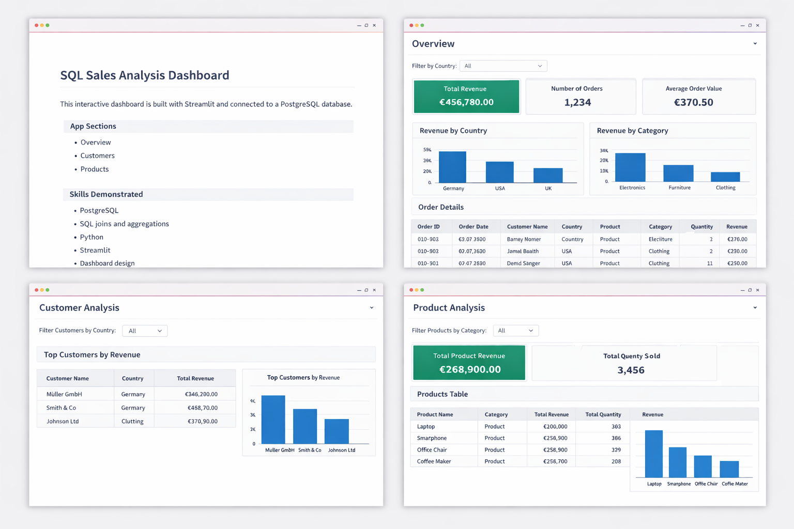

# 🚀 SQL Sales Analysis Project


---

## 📊 Overview

This project demonstrates an **end-to-end data analysis workflow** using PostgreSQL and Python.

It starts with a simple flat sales table and evolves into a **fully relational data model** with:

* Customers
* Products
* Orders

The project is extended into an **interactive multi-page dashboard** built with Streamlit, transforming SQL analysis into a real data application.

---

## 🖥️ Dashboard Preview



---

## 🛠️ Tech Stack

* **Database:** PostgreSQL
* **Querying:** SQL (psql)
* **Backend:** Python (pandas, SQLAlchemy)
* **Frontend:** Streamlit
* **Version Control:** Git & GitHub
* **Environment:** macOS Terminal

---

## 📁 Project Structure

```id="structblock"
sql-portfolio-project/
├── app/
│   ├── Home.py
│   ├── db.py
│   ├── queries.py
│   └── pages/
│       ├── 01_Overview.py
│       ├── 02_Customers.py
│       └── 03_Products.py
├── data/
│   └── raw/
├── sql/
│   ├── 01_create_schema.sql
│   ├── 02_create_tables.sql
│   ├── 03_insert_data.sql
│   ├── 04_analysis.sql
│   ├── 05_create_relational_model.sql
│   ├── 06_insert_relational_data.sql
│   └── 07_join_analysis.sql
├── outputs/
├── images/
│   └── dashboard.png
├── README.md
└── requirements.txt
```

---

## 🧠 Database Schema

The relational model contains:

* `customers`
* `products`
* `orders`

### 🔗 Relationships

* Each order belongs to one customer
* Each order contains one product
* Customers and products are linked through orders

---

## 💡 SQL Skills Demonstrated

* Data Definition: `CREATE SCHEMA`, `CREATE TABLE`
* Data Manipulation: `INSERT`, `COPY / \copy`
* Querying: `SELECT`, `GROUP BY`, `ORDER BY`
* Aggregations: `SUM`, `AVG`
* Relational Logic: `JOIN`
* Data Integrity: Primary Keys, Foreign Keys

---

## 🐍 Python & Data Skills

* Database connection via SQLAlchemy
* Query execution using pandas
* Data transformation and filtering
* Clean architecture (db / queries / UI separation)

---

## 📊 Streamlit Dashboard (Version 2)

### 📄 Pages

* Home
* Overview
* Customers
* Products

### ⚙️ Features

* KPI cards (Revenue, Orders, Avg Order Value)
* Revenue analysis by country & category
* Customer insights
* Product performance tracking
* Interactive filters
* Dynamic tables and charts

---

## ⚡ How to Run the Project

### 1. Start PostgreSQL

```bash
brew services start postgresql@18
```

### 2. Activate virtual environment

```bash
source venv/bin/activate
```

### 3. Install dependencies

```bash
pip install -r requirements.txt
```

### 4. Run Streamlit app

```bash
streamlit run app/Home.py
```

👉 Open in browser:
http://localhost:8501

---

## ❓ Business Questions Answered

* What is total revenue?
* Which country generates the most revenue?
* Which product category performs best?
* Who are the top customers?
* What are the best-selling products?

---

## 📈 Key Insights

* Germany generates the highest revenue
* Electronics is the top-performing category
* Laptop is the highest-revenue product
* Revenue is concentrated among a few customers

---

## 🔮 Future Improvements

* Add time-series analysis (date filtering)
* Implement window functions (ranking, trends)
* Use SQL views for cleaner queries
* Integrate Plotly for advanced visualizations
* Deploy dashboard (Streamlit Cloud / Render)

---

## 👤 Author

**Jan Momberg**

---

## ⭐ Project Value

This project demonstrates:

* Real-world SQL workflow
* Relational database design
* Backend + frontend integration
* Data storytelling via dashboards

👉 Designed as a **portfolio project for Data Analyst roles**


